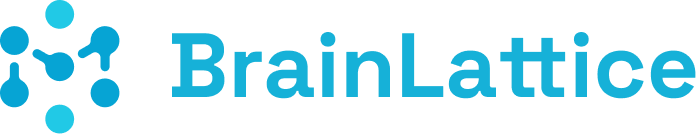

<div align="center">



_Textbook becomes mind map, **before** you even finish reading._

**BrainLattice** maps the lattice structure of knowledge onto your brain's neural network. Learning designed for how the mind actually works.

</div>

<div align="center">

[](https://nextjs.org/)
[](https://fastapi.tiangolo.com/)
[](https://ai.google.dev/)
[](https://fish.audio/)
[](https://firebase.google.com/)

</div>

---

## Overview

Traditional learning forces linear consumption of non-linear information. **BrainLattice** flips this paradigm by transforming static PDF textbooks into interactive, explorable knowledge graphs. It uses LLMs to extract core concepts, identify relationships, and generate high-fidelity study materials, allowing users to understand the "system" of a subject before memorizing the details.

## Key Features

- **Obsidian-like Knowledge Graph** - Spatially explore concepts. `Cmd + Shift + Click` to drill down into formulas, theorems, and prerequisites.
- **Contextual Synthesis** - Auto-generates study guides and entity summaries from raw text.
- **Audio Briefs** - Converts synthesized notes into podcast-style audio via Fish Audio.
- **Universal Input** - Works with any text-heavy PDF: textbooks, research papers, lecture notes.

## Tech Stack

- **FastAPI + Next.js**
- **Google Gemini 2.5 Flash** - Concept extraction & graph topology.
- **Grok 4 (OpenRouter)** - Summarization & synthesis.
- **Fish Audio** - Low-latency and cost-effective TTS.
- **React Force Graph** - WebGL-powered visualization.
- **Firebase** - Real-time data & auth.

## Getting Started

### Prerequisites

- Python 3.10+
- Node.js 18+
- [Fish Audio API Key](https://fish.audio/)
- [Google Gemini API Key](https://ai.google.dev/)
- [OpenRouter API Key](https://openrouter.ai/keys)
- [Firebase Service Account](https://firebase.google.com/docs/admin/setup)

### Installation

1. **Backend Setup**

   ```bash
   cd backend
   pip install -r requirements.txt
   uvicorn main:app --reload
   ```

   _Server runs at `http://localhost:8000`_

2. **Frontend Setup**
   ```bash
   cd frontend
   npm install
   npm run dev
   ```
   _App runs at `http://localhost:3000`_

### Configuration (`backend/.env`)

```bash
GEMINI_API_KEY=your_gemini_key
OPENROUTER_API_KEY=your_openrouter_key
FISH_AUDIO_API_KEY=your_fish_audio_key
FIREBASE_SERVICE_ACCOUNT_PATH=secrets/firebase_private.json
```

## How It Works

1.  **Ingestion**: PyPDF extracts raw text from uploaded documents.
2.  **Synthesis**: Grok 4 (via OpenRouter) identifies sequential concepts.
3.  **Mapping**: Gemini 2.5 constructs the hierarchical knowledge graph.
4.  **Generation**: The system produces study guides and audio scripts.
5.  **Audio**: Scripts are streamed to **Fish Audio** for TTS generation.

---

[View on Devpost](https://devpost.com/software/brainlattice)
