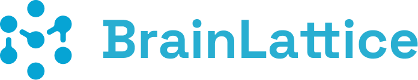
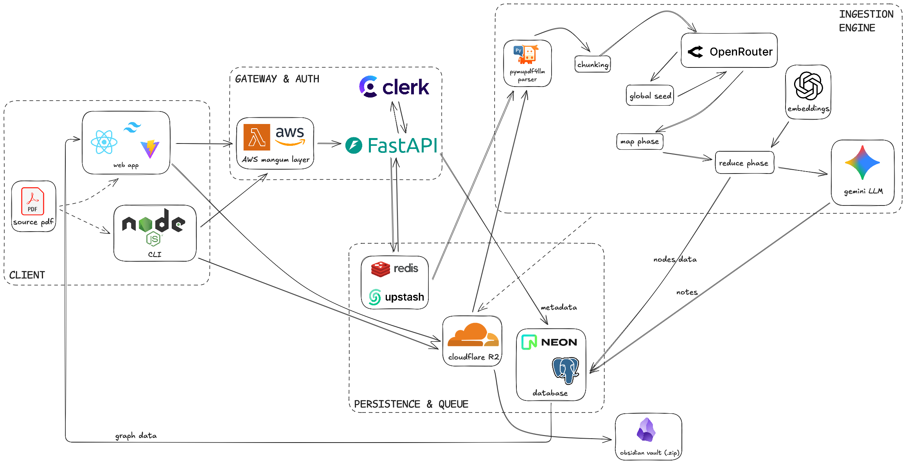

<div align="center">

<a href="https://brainlattice.rickytang.dev"></a>

<br>

**PDFs → Living Knowledge Networks**


<!-- [](https://www.npmjs.com/package/brainlattice) -->

Upload a PDF. Get an Obsidian vault. BrainLattice extracts concepts, maps relationships, and writes all the notes automatically.

</div>

---

## Demo

https://github.com/user-attachments/assets/765c4959-ead3-4b88-8e18-a7f09d6d923e

https://github.com/user-attachments/assets/57beb200-7493-40d0-ae18-031e1415e752

Or watch it on [YouTube](https://youtu.be/T3rIfQf7UWE).

## The Problem

PDFs are linear, but knowledge is a network. Tools like NotebookLM or ChatPDF are great for quick Q & A, but they lock your data inside their SaaS ecosystems.

Turning a 200+ page textbook into a structured system of notes, links, and concepts in your own Obsidian vault, is a manual work that most people never finish.

## The Solution

BrainLattice reads the PDF and does all of it automatically: extracts concepts, maps relationships, and writes full markdown notes. Drop it into Obsidian and you're way ahead in learning the contents.

- **Obsidian Vaults**: Auto-generated notes with `[[backlinks]]` ready to open in Obsidian.
- **WebGL Knowledge Graph**: Interactive, searchable force graph. See the whole textbook in one canvas.
- **Source-grounded Notes**: Every note is synthesized from actual source chunks—more relevant and no hallucinations.
- **Concept Hierarchy**: Ancestors (prerequisites) and descendants for every node.
- **CLI Workflow**: `brainlattice` -> `config` -> `gen path/to/pdf` — done.
- **BYOK**: API keys stay in-memory. Never stored.

## Tech Stack

- **Frontend**: React + Vite + Force Graph (WebGL)
- **Backend**: FastAPI
- **Database**: Neon PostgreSQL
- **Infra**: AWS Lambda, Cloudflare R2, Upstash Redis, Upstash QStash
- **CLI**: Node.js (Commander.js)

## How to use

Requires API keys from [Google AI](https://aistudio.google.com/), [OpenRouter](https://openrouter.ai/settings/keys), and optionally, [OpenAI](https://openai.com/index/openai-api-platform/).

### BrainLattice Web App

1. Open [BrainLattice web app](https://brainlattice.rickytang.dev).
2. Fill in your API keys by clicking the settings icon in the top navigation bar.
3. (Optional) You can sign up for an account to sync your projects across devices; otherwise it's local-only.
4. Upload a PDF.
5. Wait for the graph generation to complete.
6. Click on any node to view the LLM-generated notes.
7. If you want a Obsidian vault with full notes, click "export" to export the graph, and click "download" to download the prepared zip file. Then unzip the file and open it in Obsidian (File > Open Vault > Open Folder as Vault).

### BrainLattice CLI

#### Installation

```bash
npm i -g brainlattice
```

#### Start

This will open an interactive session.

```bash
brainlattice
```

#### Core Usage

Optionally login (if you want projects to sync across devices).

```bash
login
```

Configure your vault & keys.

```bash
config
```

Generate a vault from a local pdf.

```bash
gen path/to/pdf
```

_For more details, see the [CLI Documentation](cli/README.md) or enter `help` in the interactive session._

## Architecture



## Local dev

_For full setup details, see the specific READMEs in `/frontend` and `/backend`._

### 1. Configure Keys

Create a `.env` in `backend/` with your API keys and DB URL ([Neon PostgreSQL](https://neon.tech/) required, make sure to enable pooled connections):

```bash
GEMINI_API_KEY=your_gemini_key_here
OPENROUTER_API_KEY=your_openrouter_key_here
DATABASE_URL=your_db_url_here
```

### 2. Start Backend

```bash
cd backend
uv sync
uv run uvicorn main:app --reload
```

### 3. Start Frontend

```bash
cd frontend
npm install
npm run dev
```

The app will be live at `http://localhost:5173`.

## More Info on Local Development/Self-Hosting

Consult the `README.md` files inside the `frontend/` and `backend/` folders for detailed instructions.

## Contributions

Please open an issue or submit a pull request!

## License

MIT
